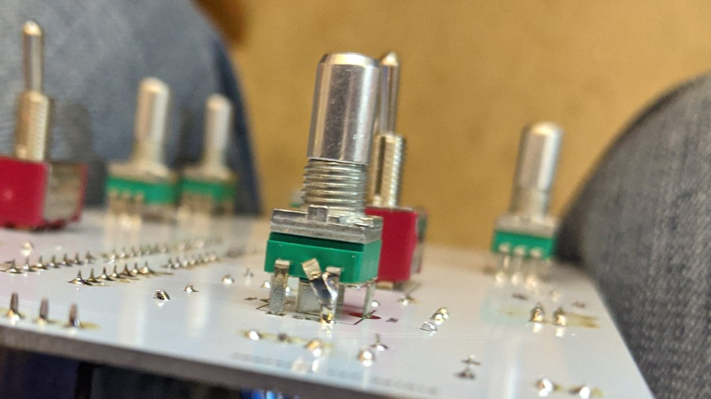
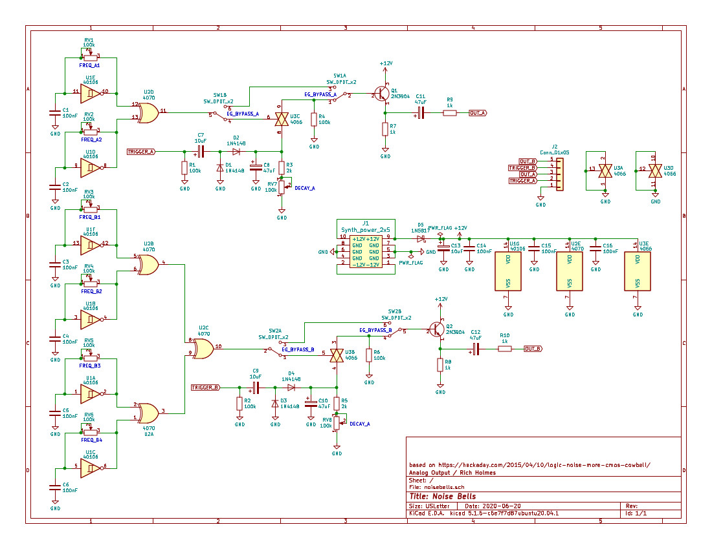
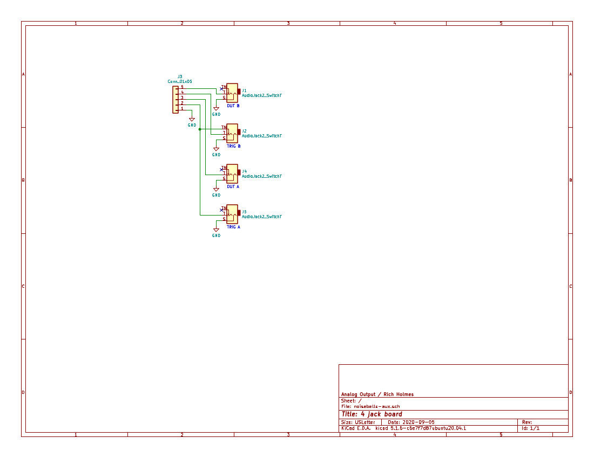
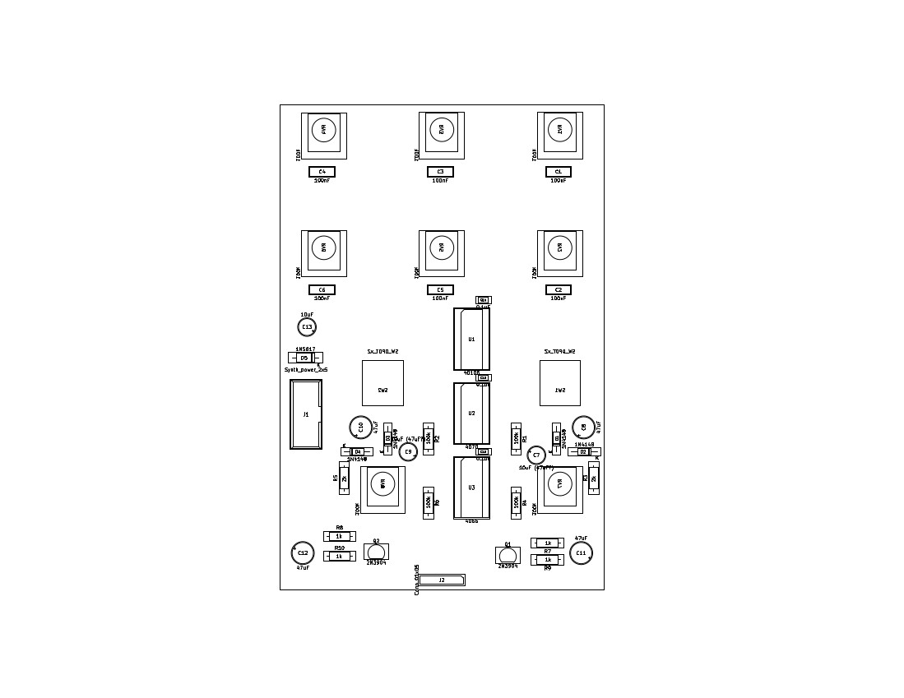

# Noise Bells synthesizer module

This is a percussion and drone synth module based on ideas presented in the 2015 Hackaday article "[Logic noise: More CMOS cowbell!](https://hackaday.com/2015/04/10/logic-noise-more-cmos-cowbell/)" by Elliot Williams. The PCB and front panel are Kosmo format but the same circuit could be implemented in Eurorack format, or other ±12V formats, with no changes other than PCB, panel, and jack dimensions.

The module consists of two separate sections. One is a 2-oscillator circuit based on the "cowbell" section of the Hackaday article. The other is a 4-oscillator circuit, lying sort of halfway between the "cowbell" and "hi hat" designs and designed to use most of the IC functionality left over from the "cowbell" side. Whether it leans more toward bell or cymbal sounds I leave for you to decide. The two sections differ only in the number of oscillators and XORs used.

Aside from a few component value changes, notably a larger capacitor allowing longer decay times, there are a couple of significant modifications to Williams's design:

* The 2-diode "VCA" has been replaced by a 4066 analog switch "VCA" as discussed in the articles' comments and at [http://files.electro-music.com/forum/viewtopic.php?highlight=diode+vca&t=23960](http://files.electro-music.com/forum/viewtopic.php?highlight=diode+vca&t=23960). 
* A switch has been added to bypass the EG/VCA section, sending the output of the final XOR straight to the output buffer. This allows using the module for noisy drones.

Pots are used for variable oscillator frequencies and amplitude envelope decay rates. 

For BOM, schematics, and PCB layout see the [Docs](Docs) folder. The build should be entirely straightforward except, on the first run boards, for the issues mentioned below. Presumably any small signal NPN transistor can be substituted for the 2N3904, though I have not tested any others. 

**Note:** On the first run PCBs the delay pots are connected incorrectly. To fix this, bend the middle leg up and solder it to the leg on its right (pin 2 to pin 3):

This is only for the two delay pots. The six oscillator frequency pots are okay.

Also two capacitors are marked '10uF (47uF?)'. These are 10µF. Unless you like 47µF better of course.

These problems are corrected in the current version.

